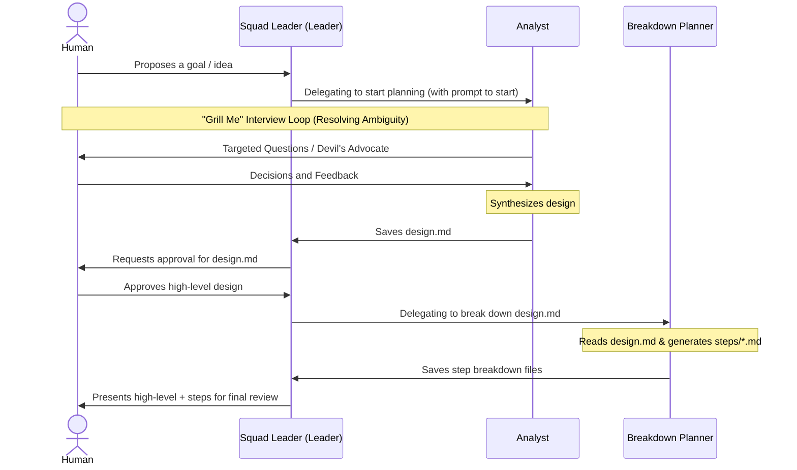

# Design Document: Brainstorming & Design Squad (`design-v1`)

## User Story
* **Headline**: Create a specialized conversation-driven brainstorming and design squad for Multica.
* **Problem Statement**: Standard development squads (like `build-v1`) are highly implementation-focused and eager to execute coding steps immediately. This creates friction when a user wants to brainstorm, explore technical options, and map out requirements *before* deciding what to build. We need a purely conversational design/brainstorming squad that specializes in requirement gathering, high-level architecture design, and logical breakdown, without writing any application code.
* **Objective**:
  1. Establish a new squad directory `design-v1/` with a routing controller `squad-instructions.md`.
  2. Implement a `Leader` agent (`design-v1/agents/design-leader.md`) to coordinate tasks, communicate with the user, and handle lifecycle hand-offs.
  3. Implement an `Analyst` agent (`design-v1/agents/design-analyst.md`) that researches the codebase/`agent_docs`, interviews the user ("Grill Me" protocol), and writes the high-level `design.md` file.
  4. Implement a `Breakdown Planner` agent (`design-v1/agents/design-planner.md`) that takes the approved `design.md` and generates structured, sequential step files (`steps/*.md`) under the plan folder, ensuring correct logical dependencies.
* **Expected Outcome**: A user can start a conversation with the `design-v1` squad to collaborate on designs, refine ideas, and generate full `agent_docs`-compatible feature designs and step breakdowns, ready for human-in-the-loop sign-off.

## Implementation Backlog

### Pending
- (None)

### Current
- (None)

### Completed
- [x] `01-create-squad-instructions.md`: Create the high-level routing controller and protocols in `design-v1/squad-instructions.md`.
- [x] `02-create-leader-agent.md`: Implement the Squad Leader `leader.md` agent for coordination.
- [x] `03-create-analyst-agent.md`: Implement the `analyst.md` agent for conversational interviewing and writing high-level `design.md` files.
- [x] `04-create-planner-agent.md`: Implement the `planner.md` agent for generating step-by-step breakdowns and verifying alignment.

## Architecture Overview

### Folder Structure
The squad configuration resides completely within `design-v1/`:
```text
design-v1/
├── squad-instructions.md
└── agents/
    ├── leader.md
    ├── analyst.md
    └── planner.md
```

### Communication Flow Diagram


### Key Behaviors

1. **Research First**: The `Analyst` and `Planner` must read any existing `agent_docs/` or code files to understand patterns, context, and dependencies before asking redundant questions.
2. **"Grill Me" Protocol**: The `Analyst` asks questions one at a time, plays devil's advocate, and prevents premature implementation.
3. **No Implementation**: Absolutely zero code files should be written by any squad member.
4. **Agent Docs Compatibility**: Outputs are strictly written to `agent_docs/04_plans/<feature-name>/design.md` and `agent_docs/04_plans/<feature-name>/steps/*.md`.

## Checklist & TDD Requirements
1. **Frontmatter & YAML Formatting**: All agent markdown files must have valid YAML frontmatter blocks containing `description`, `mode`, and `permission`.
2. **Mentions & References**: All squad instructions and coordinator instructions must use valid agent mentions (`[@AgentName](mention://agent/<agent-uuid>)`) corresponding to available squad members.
3. **Execution Manual Checklist**: Validate each file manually to ensure instructions are clear and free of ambiguities before final deployment.
