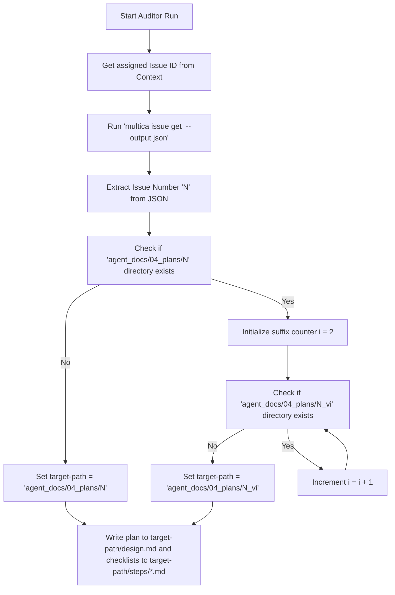

# Design Document: Dynamic Documentation Backfill Folder

## User Story

* **Headline**: Enable dynamic, collision-free folder names for the documentation backfill squad to prevent file churn.
* **Problem Statement**: Currently, the documentation backfill squad (`doc-v1`) hardcodes the folder path `agent_docs/04_plans/doc_backfill_plan/` for its design plans and steps. When multiple backfills or runs occur, files in this folder constantly churn, git history is overwritten, and historical runs are lost.
* **Objective**:
  1. Modify the `doc-auditor-v1` instructions to dynamically resolve a unique plan folder path under `agent_docs/04_plans/` using the active issue number.
  2. Implement an automatic collision-resolution mechanism that appends sequential suffixes (e.g. `_v2`, `_v3`) if the folder for the current issue number already exists.
  3. Ensure both the high-level `design.md` and the granular `steps/*.md` are written to this newly resolved path.
* **Expected Outcome**: Each backfill plan is isolated in a folder named after its issue number (and potential version suffix), eliminating folder churn, preserving git history of distinct plans, and enabling concurrent backfill planning.

---

## Implementation Backlog

## Pending
- (None)

## Current
- (None)

## Completed
- `01-update-auditor-folder-resolution.md`: Update the Squad Auditor's (`doc-auditor-v1.md`) role instructions to dynamically determine the issue number, resolve the collision-free plan directory, and use it when writing the design plan and step checklists.

---

## Architecture Overview

### Folder Structure
No new directories or configuration files are created outside of the dynamic plan directories. The squad instructions and agent definitions themselves are updated:
```text
doc-v1/
└── agents/
    └── doc-auditor-v1.md   ← Updated to dynamically resolve paths
```

### Dynamic Path Resolution Logic


---

## Checklist & Requirements

### 1. Functional Requirements
* **Issue Number Extraction**: The `doc-auditor-v1` must extract the `"number"` field from the JSON output of `multica issue get <issue-id>`.
* **Dynamic Directory Path**: The target directory path for saving the plan must be resolved as `agent_docs/04_plans/<folder-name>`, where `<folder-name>` is either the issue number `N` or versioned `N_vI`.
* **Sequential Versioning**: Versioning must start at `_v2` and increment sequentially (`_v3`, `_v4`, etc.) until a non-existent folder name is found.
* **Step File Output Location**: Ensure all generated step markdown files are written under the dynamic path `agent_docs/04_plans/<folder-name>/steps/*.md`.

### 2. Markdown Changes in `doc-auditor-v1.md`
The following specific text blocks under "3. Actionable Backfill Planning" in `doc-v1/agents/doc-auditor-v1.md` must be updated:
* Change from hardcoded `agent_docs/04_plans/doc_backfill_plan/design.md` to dynamic `<target-path>/design.md`.
* Change from hardcoded `agent_docs/04_plans/doc_backfill_plan/steps/*.md` to dynamic `<target-path>/steps/*.md`.
