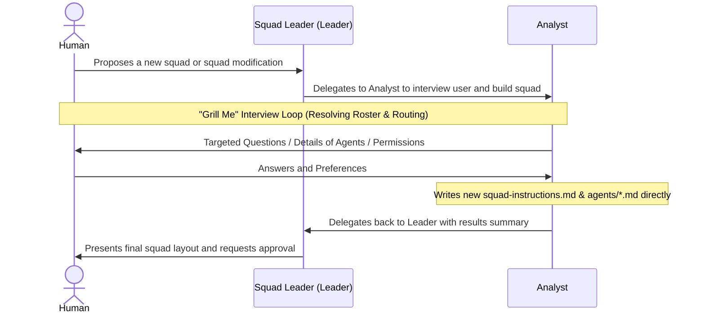

# Design Document: Multica Squad Creator (`multica-v1`)

## User Story
* **Headline**: Create a specialized conversation-driven squad creation and editing squad (`multica-v1`) for Multica.
* **Problem Statement**: Creating or updating Multica squads and agents requires detailed knowledge of permission schemas, routing instructions, and agent frontmatter blocks. Relying on general developers to write these is slow and error-prone. We need a specialized squad that can interview a user, determine their desired squad/agent behaviors, and automatically generate or update the entire squad layout (instructions, agents, directories) in accordance with Multica standards.
* **Objective**:
  1. Establish a new squad directory `multica-v1/` with a routing controller `squad-instructions.md`.
  2. Implement a `Leader` agent (`multica-v1/agents/leader.md`) to coordinate state hand-offs, prompt the analyst, and seek final human approval.
  3. Implement an `Analyst` agent (`multica-v1/agents/analyst.md`) with full access permissions to interview the user, draft the squad structure, and write the agent markdown files and squad instructions directly.
* **Expected Outcome**: A user can run the `multica-v1` squad to easily create new squads or modify existing ones through a seamless, conversational interviewing experience, resulting in well-structured, compliant agent and instruction files.

## Implementation Backlog

### Pending
- (None)

### Current
- (None)

### Completed
- [x] `01-create-squad-instructions.md`: Create the high-level routing controller and protocols in `multica-v1/squad-instructions.md`.
- [x] `02-create-leader-agent.md`: Implement the Squad Leader `leader.md` agent for coordination.
- [x] `03-create-analyst-agent.md`: Implement the `analyst.md` agent for conversational interviewing and writing agent/squad files directly.

## Architecture Overview

### Folder Structure
The squad configuration resides completely within `multica-v1/`:
```text
multica-v1/
├── squad-instructions.md
└── agents/
    ├── leader.md
    └── analyst.md
```

### Communication Flow Diagram


### Key Behaviors

1. **Self-Contained Squad Generation**: The `Analyst` is empowered to directly write and edit directory trees, `squad-instructions.md`, and `agents/*.md` for any new/existing squad.
2. **"Grill Me" Protocol**: The `Analyst` asks targeted questions (squad goals, agent rosters, permissions, state machine flow) one or a few at a time to keep the session highly efficient.
3. **Strict Conformity**: New squads and agents created must conform strictly to standard Multica schemas:
   - Agents must use valid YAML frontmatter blocks with `description`, `mode`, and `permission`.
   - Instructions and leader definitions must use valid markdown `[@AgentName](mention://agent/<agent-uuid>)` formatting for coordination.

## Checklist & TDD Requirements
1. **Frontmatter & YAML Formatting**: All agent markdown files must have valid YAML frontmatter blocks containing `description`, `mode`, and `permission` with appropriate values.
2. **Mentions & References**: All squad instructions and coordinator instructions must use valid agent mentions (`[@AgentName](mention://agent/<agent-uuid>)`) corresponding to available squad members.
3. **Execution Manual Checklist**: Validate that the generated files have no typos, follow appropriate folder paths, and match permissions correctly before finalizing the plan.
